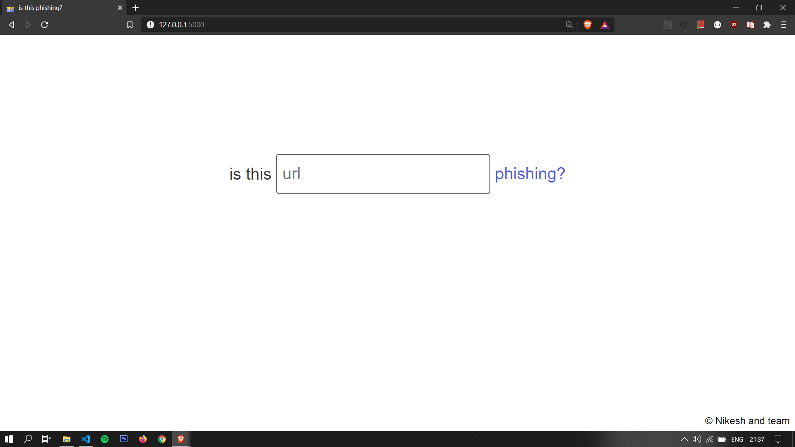

# Website Phishing Detector

A Machine Learning project which determines if a url is phishing or not.

Enter the url you want to check and hit 'phishing' button. Our machine learning model will accurately predict if the entered url is phishing or not and will show you the result.

## Working

We created three models to predict the outcome and chose whichever was the most accurate one. Model can be improved with selecting more features from the dataset. Currently we selected 11 parameters to predict the outcome.

1. run 'checkUrl.py' on your local computer and the flask server will start running.
2. Open the link that the server will return.
3. A browser will open with the project interface.
4. Start checking the urls for phishing.
5. Enjoy.

## Screenshot
